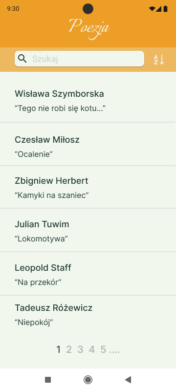
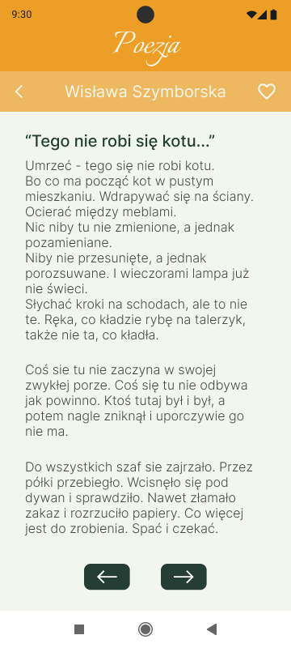
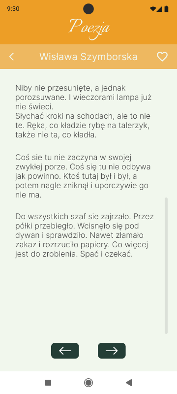

# Specyfikacja

**Poetry** to aplikacja, która umożliwia znalezienie poezji ulubionego autora.

Aplikacja składa się z dwóch stron:

- strona z listą wszystkich wierszy
- strona wyświetlająca wybrany wiersz

Każda ze stron zawiera dwa główne komponenty:

- listę wierszy
  - posortowaną alfabetycznie
  - filtrowaną za pomocą inputu po imieniu
- ekran wybranego wiersza

## Źródła danych potrzebne do zaimplementowania aplikacji

Do zaimplementowania funkcjonalności aplikacji będzie potrzebne następujące API:

- [PoetryDB API](https://github.com/thundercomb/poetrydb#readme) - informacje o autorach i książkach

## Strona z listą wszystkich autorów

### Elementy strony

- Lista powinna wyświetlać imię, nazwisko autora i nazwę wiersza
- Nawigacja do ekranu z poezją następuje po wybraniu wiersza z listy
- Filtrowanie autorów alfabetycznie za pomocą przycisku z ikonką
- Wyszukiwanie autorów za pomocą inputu po imieniu i nazwisku

### Widoki

## Strona wybranego wiersza

### Elementy strony

- Imię i nazwisko autorki
- Nazwa wiersza
- Do wyświetlania zawartości wiersza można użyć paginacji
- Możliwość powrotu do listy wszystkich autorów

### Widoki

### Uwagi

- Polecamy skupić się na zaimplementowaniu funkcjonalności, a nie na wyglądzie strony
